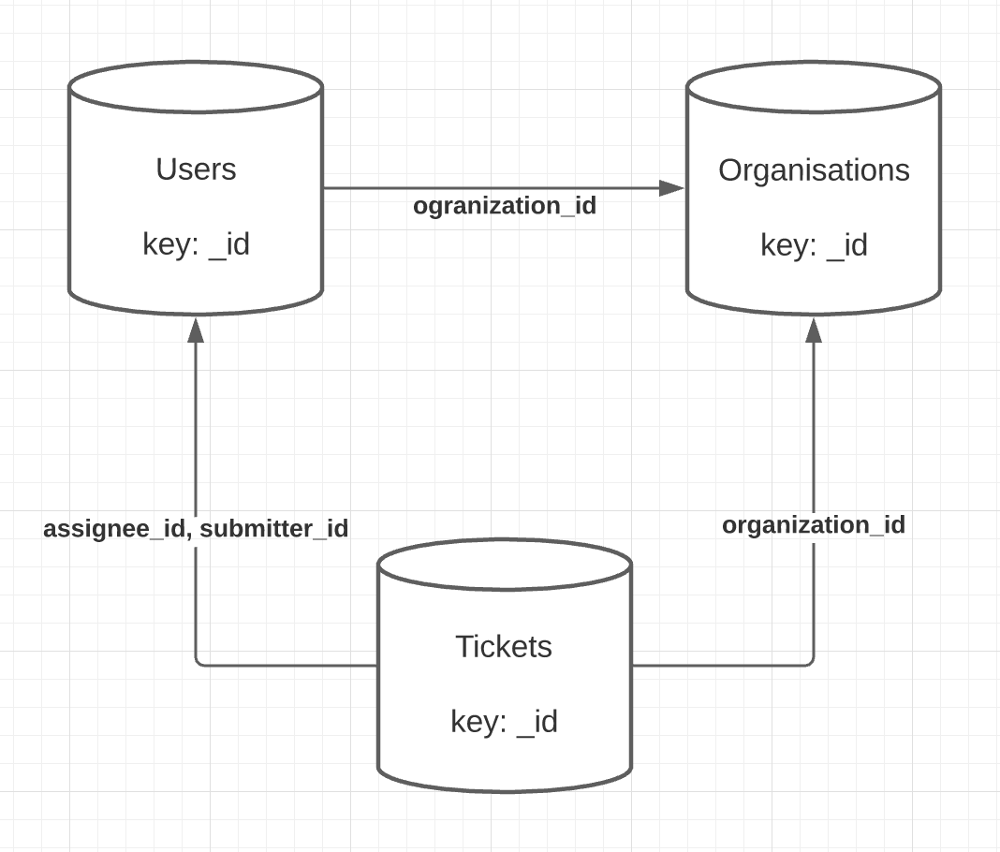

# Design doc

## Distilled Requirements

- Command line interface
- Load three json files - store in memory, persistence between sessions is not required
- Prompt: Choose data source
- Prompt: Keyword search
  - Results in human readable format
  - Display data from related entities
  - When no results; display helpful message
  - Allow search extensions like: isEmpty:key
  - Allow search on any value
- Handle and report errors
- Allow user to search again or show help or quit

## Technical design

### Reading files

- Read 3 local JSON files into memory
- ~~Use Node's `readFileSync`~~
  - Typescript allows us to require json files directly using require which simplifies things.

### Storing & retreiving data

Given that we know the data shapes, and the data depth is relatively shallow, we can use ragular old JS objects as a dictionary.
In a larger application that requires DB persistence I would use something like GraphQL, Rails or MongoDB and lean on their vastly superior data relationship modelling.

### Relationships

Relationships between data files will be defined in Typescript types. In a real-world application and with more time, I would have liked to explore how a graphQL schema might have made this more extensible than static TS types.

### CLI parser

Node handles this well with `readline` but can be cumbersome with callback functions. `readline-sync` has a cleaner way to use the API synchronously.

### Searching options

- User should be able to search on any value in any data E.g. `Bill`
- User should be able to search on empty values E.g. `isEmpty:name`
